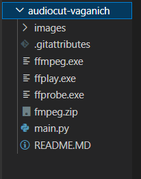
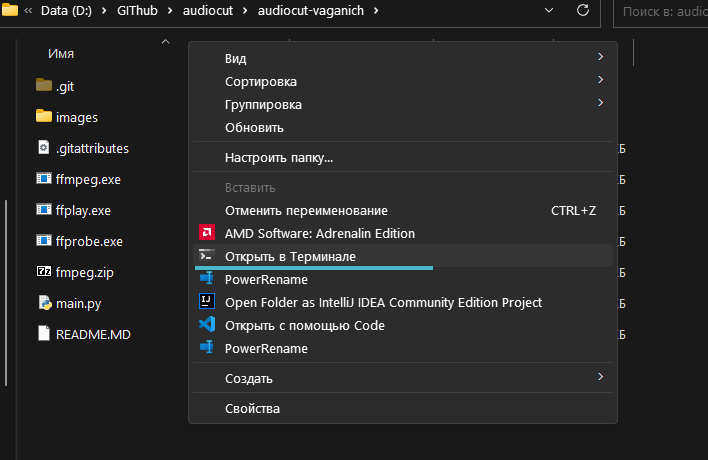
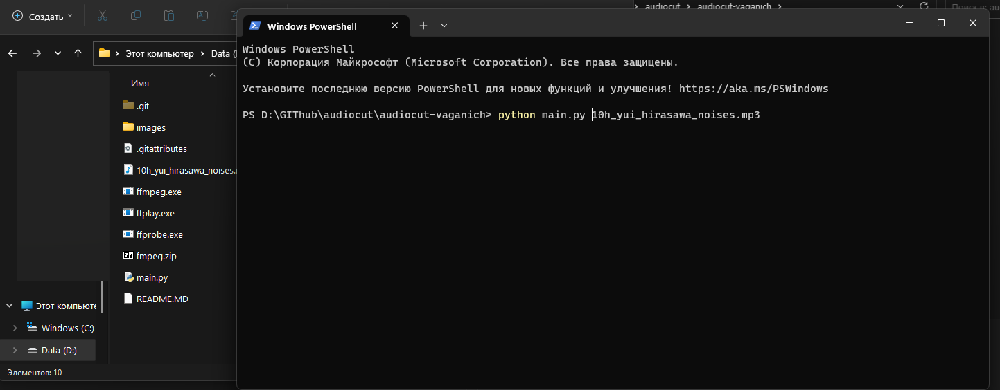

<h1><b>Нарезчик аудио для Вагонят.</b></h1>

Написал маленький скрипт на python, который позволит нарезать аудио-материал по 10 секунд

<h3>- Чтобы завести. <b>Нужно докачать библиотеку ffmpeg и все файлы поместить возле скрипта </b></h3>

<h3>- Кушает любые аудио-форматы, которые доступны в fmpeg </h3>

</img>

<h></h>

Использовать просто:

<code>python main.py filename.mp3 </code>

Пример:

</img>

</img>

